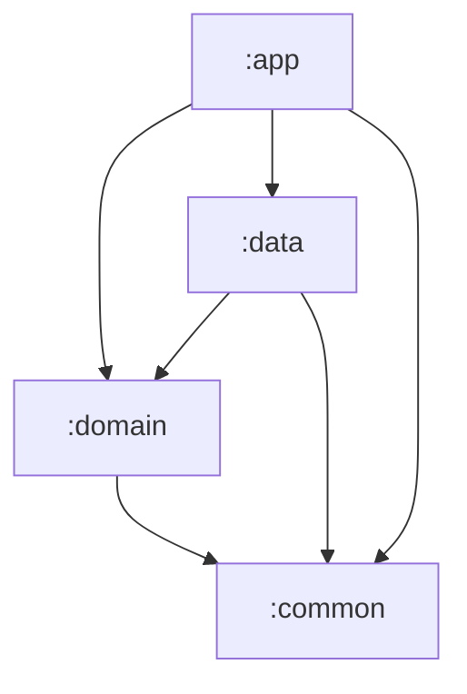

# 🌦 Weather App — Technical Assessment

## Overview
Bold Weather App is a modern Android application that allows users to check current weather conditions and forecasts. It features a "search as you type" interface, detailed 3-day forecasts, and offline capabilities.
The app is built to demonstrate:
- **Current Weather**: Instant access to real-time weather data.
- **3-Day Forecast**: Future forecast details.
- **Real-time Search**: Search for cities with debounce and cancellation support.
- **Offline Cache**: Caches recent searches and forecast data for offline access.
- **Recent Searches**: Quick access to recently searched locations.

## Architecture
The project follows **Clean Architecture** principles and **MVVM** pattern, modularized by layer:



- **:app (Presentation)**: Contains UI (Compose), ViewModels, and dependency injection (Hilt).
- **:domain (Business Logic)**: Pure Kotlin module. Contains UseCases, Models, and Repository interfaces.
- **:data (Data Layer)**: Implements Repositories. Handles API calls (Retrofit), Local Database (Room), and Mappers.
- **:common**: Shared utilities and constants.

## Data Flow
1.  **UI** (Compose) observes **ViewModel** state.
2.  **ViewModel** executes **UseCase**.
3.  **UseCase** delegates to **Repository** interface.
4.  **RepositoryImpl** (:data) fetches data from **Remote** (API) or **Local** (Database/Cache).
5.  Data is mapped to Domain models and returned up the chain.

## Technologies Used
- **Kotlin**: 100% Kotlin codebase.
- **Jetpack Compose**: Modern UI toolkit.
- **Navigation Compose**: Type-safe navigation.
- **Hilt**: Dependency Injection.
- **Retrofit**: Network requests.
- **Kotlinx Serialization**: JSON parsing.
- **Room**: Local database for caching.
- **Coroutines + Flow**: Asynchronous programming and reactive streams.
- **Coil**: Image loading.
- **MockWebServer**: For integration testing.
- **Mockito**: For unit testing.

## Features
- **Splash Screen**: Branded launch experience.
- **Search**:
    - "As you type" search with debounce.
    - Automatic cancellation of stale requests.
    - Error handling and empty states.
- **Detail View**:
    - Current weather condition (Icon, Temp, Condition text).
    - 3-Day Forecast list.
    - **Landscape Mode**: Optimized split-view layout.
- **Offline Mode**:
    - Displays cached data when offline.
    - "Recent Searches" persist across app restarts.
- **Testing**:
    - Comprehensive Unit Tests (Domain & Data).
    - Integration Tests with MockWebServer.

## Testing Strategy
The project focuses on high-value tests:
- **Unit Tests**: Cover Mappers, UseCases, and ViewModels.
- **Integration Tests**: Verify the Data layer's interaction with network (via MockWebServer) and parsing logic.
- **No Real API Calls**: Tests strictly use MockWebServer; no real network requests are made during testing to ensure stability and speed.

## 🔐 API Key Setup

To run this project, you must configure your WeatherAPI key.

1.  Create an account at [WeatherAPI.com](https://www.weatherapi.com/).
2.  Obtain your **API Key**.
3.  Open the file `local.properties` in the project root.
4.  Add the following line:

    ```properties
    WEATHER_API_KEY=your_api_key_here
    ```

5.  Sync Gradle and run the project.

> [!WARNING]
> The API key is intentionally not included in the repository for security reasons. The app will fail to fetch data if this key is missing.

## Build Instructions

1.  **Clone** the repository.
2.  Open in **Android Studio**.
3.  **Configure API Key** in `local.properties` (see above).
4.  **Sync Gradle**.
5.  **Run** the app on an Emulator or Device.

**Requirements**:
- **minSdk**: 26
- **compileSdk**: 36
- **JDK**: 11 or higher

## AI Usage Disclosure
> **Declaration of AI Usage**:
> This project partially used AI tools to assist with:
> - **Initial UI Mockups**: Layout inspiration and concept generation.
> - **Visual Boilerplate**: Generating standard Compose layout structures.
>
> All implementation decisions, architectural patterns, refinements, and integrations were **manually reviewed and adapted** by the developer. The AI served as a productivity tool for visual scaffolding, while the core logic respects strict Clean Architecture principles.

## Possible Improvements
- **Cache Expiration**: Implement a strategy to expire cached data after a certain time (e.g., 2 hours).
- **UI Animations**: Add more advanced transitions and weather-specific animations (rain, snow).
- **Pagination**: Implement pagination for lists if the API supports it in future endpoints.
